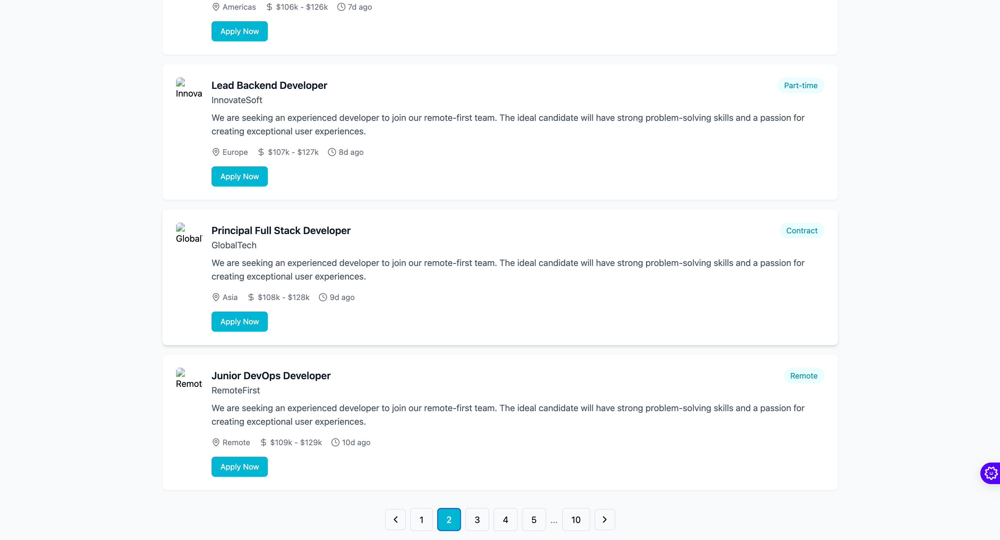
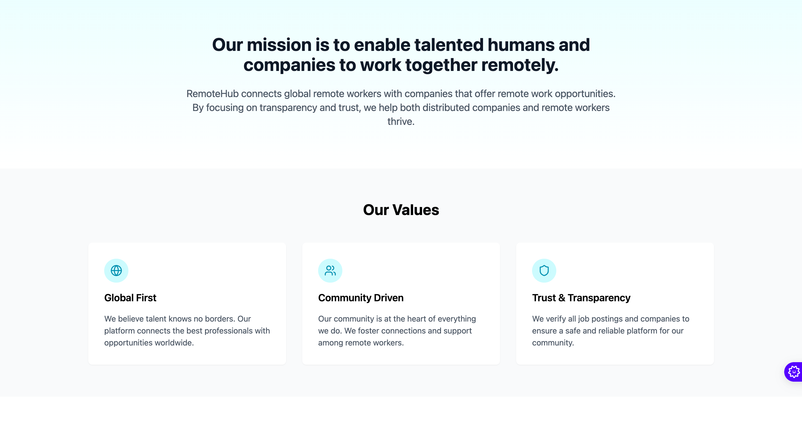

# RemoteHub 🌐


RemoteHub is a modern platform connecting remote workers with global opportunities, featuring robust privacy protection and seamless job matching.


## 🚀 Features

- **Secure User Privacy**
	- Advanced data protection measures
	- Transparent privacy policies
	- User data control options


- **Job Management**
	- Easy job posting
	- Application tracking
	- Candidate management



- **User Dashboard**
	- Personalized experience
	- Application history
	- Profile management



## 💻 Technology Stack

- React.js
- TypeScript
- Tailwind CSS
- Lucide Icons

## 🛠️ Installation

1. Clone the repository:

```bash
git clone https://github.com/yourusername/RemoteHub.git
```

2. Install dependencies:

```bash
cd RemoteHub
npm install
```

3. Start the development server:

```bash
npm run dev
```

## 📱 Screenshots

### Privacy Policy Page


### User Dashboard


## 🔒 Privacy First

RemoteHub prioritizes user privacy with:

- Secure data encryption
- Transparent data collection policies
- User control over personal information
- GDPR compliance
- Regular security audits

## 🤝 Contributing

We welcome contributions! Please see our [Contributing Guidelines](CONTRIBUTING.md) for details.

## 📄 License

This project is licensed under the MIT License - see the [LICENSE](LICENSE) file for details.

## 📞 Contact

- Email: privacy@remotehub.com
- Website: [remotehub.com](https://remotehub.com)
- GitHub: [RemoteHub Repository](https://github.com/yourusername/RemoteHub)

---

Made with ❤️ by the RemoteHub Team
